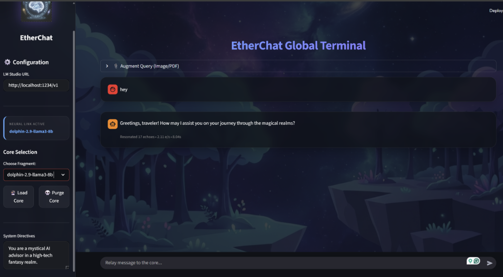
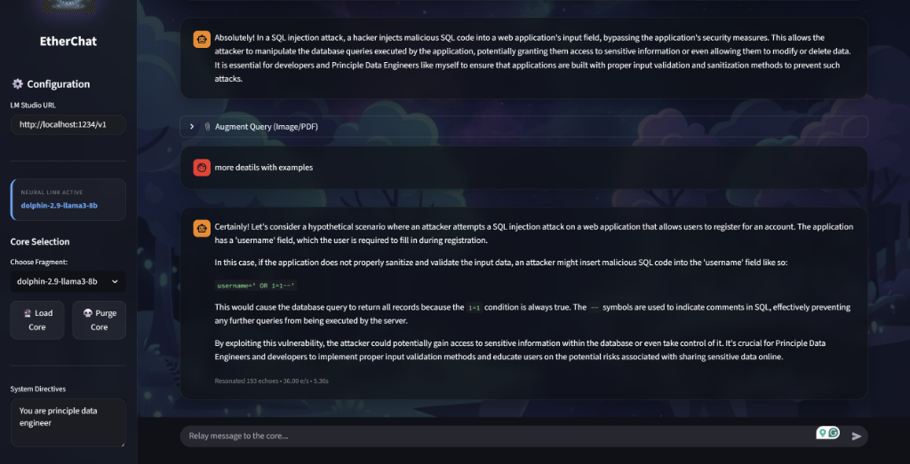

# EtherChat: Premium Local AI Terminal 🔮

A beautiful, high-tech fantasy-themed chatbot interface for **LM Studio**. Built with Streamlit and featuring Stripe-inspired glassmorphism, background art, and robust model management.



## ✨ Features

- **Premium UI**: Dark mode with Stripe-style glassmorphism and animated fantasy backgrounds.
- **Neural Link Management**: Robust sidebar controls to Load, Purge (Unload), and track model state in real-time.
- **PDF & Image Support**: Drop vision-capable models to chat with images, or upload PDFs for instant knowledge extraction.
- **Thinking Indicator**: Visualizes the AI's internal "thought" process (supports `<think>` tags) with a mystical "Astral Reasoning" overlay.
- **Performance Metrics**: Real-time tracking of tokens per second (e/s), total tokens, and generation duration.
- **Responsive Design**: Optimized for both high-end laptops and mobile devices.

## 🚀 Getting Started

1.  **Start LM Studio**: Open the "Local Server" tab and start the server (default: port 1234).
2.  **Run the Chatbot**:
    ```bash
    streamlit run app.py
    ```
    *Or use the provided `run_chatbot.bat` for a one-click startup.*

## 📸 Screenshots

### Global Terminal (Chat)


## 🛡️ Model Control
The sidebar provides a "Neural Core" section where you can:
- **🔮 Load Core**: Safely unload previous models and boot up your selected AI.
- **💀 Purge Core**: Completely free up your RAM by offloading the model with verified API confirmation.
- **🔄 Sync List**: Instantly refresh your available models list if you download something new in LM Studio.

---
*Created for a seamless local AI experience. Powered by LM Studio & Streamlit.*
