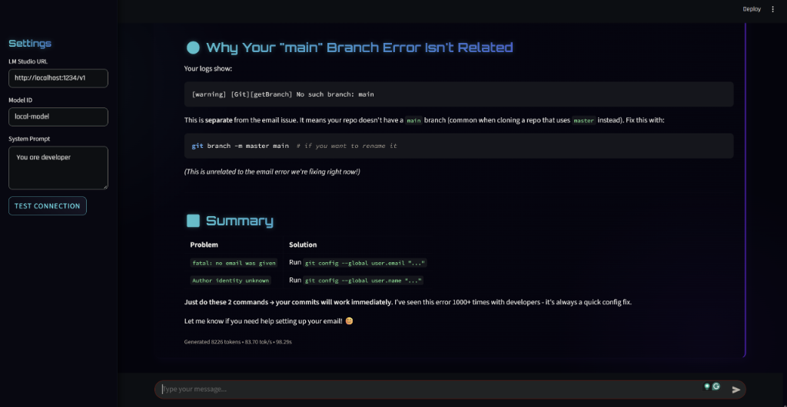

# Local Chatbot with LM Studio

A sleek, sci-fi themed web-based chatbot interface designed to work with local LLMs via LM Studio. This application provides a premium user experience for interacting with your locally hosted AI models.

## Features

*   **🚀 Sci-Fi UI**: A responsive, dark-themed interface featuring glassmorphism, smooth animations, and a futuristic aesthetic.
*   **💬 Local LLM Integration**: Connects seamlessly to LM Studio's local server API (default port 1234).
*   **🖼️ Vision Capabilities**: Support for image uploads to chat with vision-capable models.
*   **📊 Performance Metrics**: Real-time stats showing tokens per second, total tokens generated, and response duration.
*   **🧠 Chain of Thought Toggle**: Option to hide raw "thinking" process for cleaner output while maintaining a visual indicator.
*   **📱 Mobile Ready**: Fully responsive design that works great on desktop and mobile devices over the local network.

## Screenshot



## Getting Started

1.  **Start LM Studio**: Load your preferred model and start the Local Server (usually on `http://localhost:1234`).
2.  **Run the App**:
    ```bash
    python app.py
    ```
3.  **Access**: Open your browser and navigate to `http://localhost:5000`.

## Requirements

*   Python 3.x
*   Flask
*   Requests
*   Markdown
